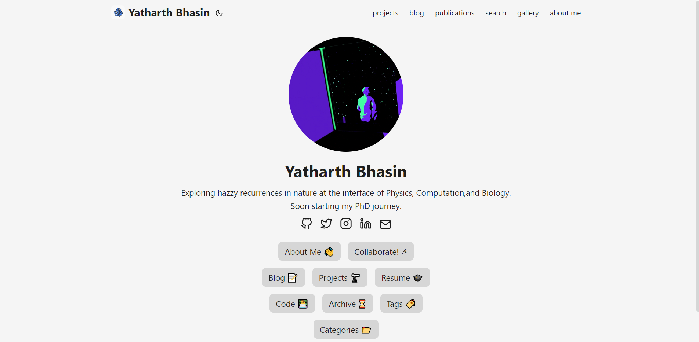

# Portfolio Website → Yatharth Bhasin
* Visit → https://yatharthb97.github.io

* Website was built using Hugo: https://gohugo.io/

## Credits

1. Theme used is **hugo-PaperMod** by Aditya Telange : https://github.com/adityatelange/hugo-PaperMod

2. **Home Page GIF** by Sam Gilmore : https://giphy.com/gifs/space-wonder-transform-u00DkhlFRgkei3d3jG

3. **ASCII Text Generation**: https://patorjk.com/software/taag/

   > License Info
   >
   > https://web.archive.org/web/20120819044459/http://www.roysac.com/thedrawfonts-tdf.aspFIGFont 
   >
   > created with: http://patorjk.com/figfont-editor

4. Page Header SVGs generated using **Go ASCII Tool (GoAT)**: https://github.com/bep/goat

---

