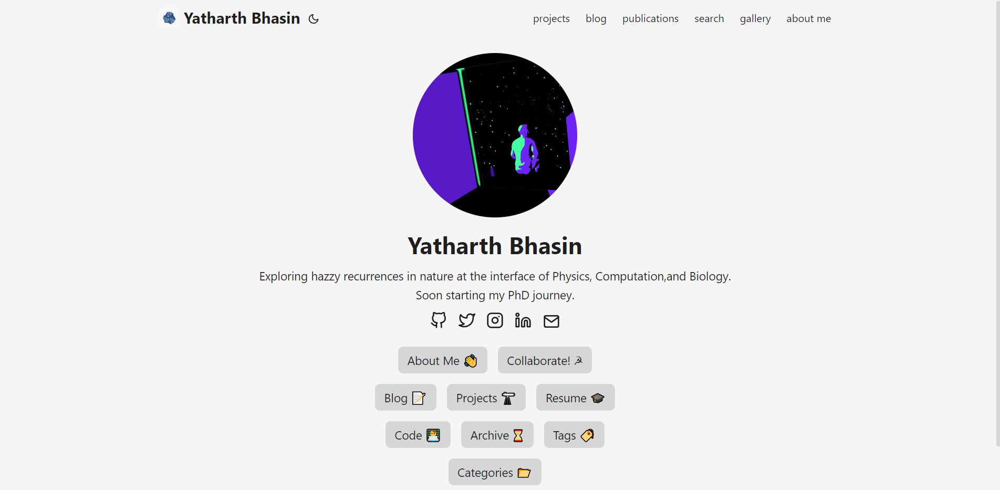

# Portfolio Website → Yatharth Bhasin
* Visit → https://yatharthb97.github.io

* Website was built using Hugo: https://gohugo.io/

## Credits

1. Theme used is **hugo-PaperMod** by Aditya Telange : https://github.com/adityatelange/hugo-PaperMod

2. **Home Page GIF** by Sam Gilmore : https://giphy.com/gifs/space-wonder-transform-u00DkhlFRgkei3d3jG

3. **ASCII Text Generation**: https://patorjk.com/software/taag/

   > License Info
   >
   > https://web.archive.org/web/20120819044459/http://www.roysac.com/thedrawfonts-tdf.aspFIGFont 
   >
   > created with: http://patorjk.com/figfont-editor

4. Page Header SVGs generated using **Go ASCII Tool (GoAT)**: https://github.com/bep/goat

## Build/CI gotchas (August 2026)

The deploy workflow (`.github/workflows/gh-pages.yml`) went stale for a long time and broke in a chain of ways once it started running again. Notes for future-me:

* **Hugo version is pinned to `0.145.0`**, not `latest`. The vendored `themes/hugo-PaperMod` submodule is locked to an old commit, and newer Hugo versions (0.15x+) changed how `partial` calls resolve paths, which breaks this theme's own `head.html` (`partial "partials/templates/_funcs/get-page-images"` can't be found). 0.145.0 is the last version confirmed to build cleanly against this theme commit. If the theme submodule is ever updated to a current release, revisit pinning to `latest`.
* **`runs-on: ubuntu-20.04` will hang forever**, not fail loudly. GitHub retired the `ubuntu-20.04` hosted runner image in April 2025; a workflow requesting it just sits at "Waiting for a runner to pick up this job..." with no error. Use `ubuntu-latest` (or a specific still-supported version).
* **Hugo now rejects duplicate top-level/front-matter YAML keys** (it used to silently let the last one win). `config.yml` previously had two separate `markup:` blocks, and one classnote had `math: false` and `math: true` both set — both are silent time bombs since regular YAML linters/parsers don't flag duplicate keys, only Hugo's own config loader does. Worth a quick grep for repeated front-matter keys (`^key:`) across `content/**/*.md` before assuming a build will pass.
* `public/` is no longer committed to git (see `.gitignore`) — it's fully regenerated by CI on every push to `main`, so there's no need to build/commit it locally.

---

