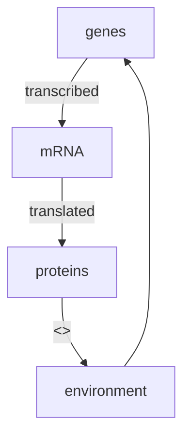
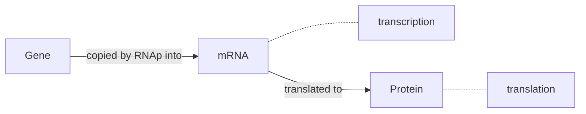

# C1 - Transcription Networks - Basic Concepts

The cell continuously monitors its environment and calculates the amount of each protein that is needed. The rate of production is controlled by **transcription networks.**

* To represent **environmental states**, cells use special proteins called **transcription factors** as *symbols*.
* Transcription factors are molecules that can rapidly switch between **active** and **inactive** molecular states, with rates determined by environmental factors.
* Transcription factors **bind to DNA** and regulate `read-rate` of genes.
* Transcription factors regulate their target genes to mobilize the appropriate protein response in each case.

**E. coli**: has an internal representation of about 300 degrees of freedom. Hence, it has 300 transcription factors.

## Transcription Network Model

**Gene**: a stretch of DNA whose sequence encodes the information needed for production of a protein.

**Transcription**: Gene is copied into a disposable mRNA molecule by RNA polymerase (RNAp).

**Promoter**: The number of mRNA produced per unit time is controlled by a regulatory region of DNA that **precedes** the gene which is called promoter. It regulates the *chemical affinity* of the DNA to mRNA (opposite is a **Repressor**).

Transcription factors bind to the 

## Input Functions

## Dynamics & Response Time

# C2 - Autoregulation - A Network Motif

## Networks

## Autoregulation

