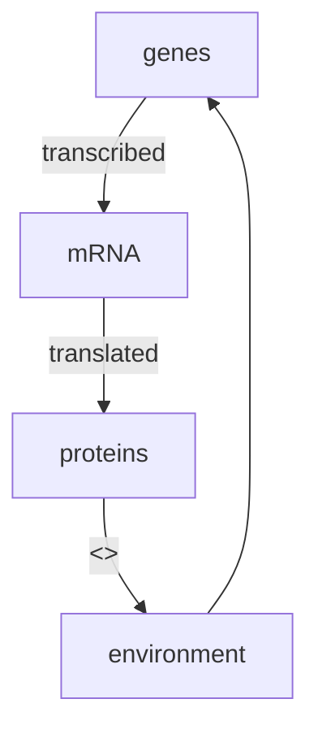
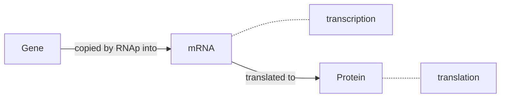

# Transcription Networks - Basic Concepts

The cell continuously monitors its environment and calculates the amount of each protein that is needed. The rate of production is controlled by **transcription networks.**

* To represent **environmental states**, cells use special proteins called **transcription factors** as *symbols*.
* Transcription factors are molecules that can rapidly switch between **active** and **inactive** molecular states, with rates determined by environmental factors.
* Transcription factors **bind to DNA** and regulate `read-rate` of genes.
* Transcription factors regulate their target genes to mobilize the appropriate protein response in each case.

**E. coli**: has an internal representation of about 300 degrees of freedom. Hence, it has 300 transcription factors.

## Transcription Network Model

* **Gene**: a stretch of DNA whose sequence encodes the information needed for production of a protein.

* **Transcription**: Gene is copied into a disposable mRNA molecule by RNA polymerase (RNAp).

* **Promoter**: The number of mRNA produced per unit time is controlled by a regulatory region of DNA that **precedes** the gene which is called promoter. It regulates the *chemical affinity* of the DNA to mRNA (opposite is a **Repressor**).

* Transcription factors can act as both: **activators and repressors.**
* Transcription factor proteins are themselves regulated by other transcription factors.

|                                                              |                                                              |
| ------------------------------------------------------------ | ------------------------------------------------------------ |
|  |  |

#### Representation of Network Nodes & Edges

* x → Y : Product of genes X is a promoter for the transcription of gene Y. 
* X ⟞ Y : Product of genes X is a repressor for the transcription of gene Y.

#### Mechanism of Transcription Networks

* The input of transcription factor network are **signals**. Each signal is a small molecule, protein modification or molecular partner that directly affects the activity of one of the transcription factors.

* The signal usually causes physical changes in the shape of the TF protein - *active* molecular state.

* Majority of the proteins are not transcription factors, rather they are building blocks or catalysts.

* Separation of Timescales:

  | Process                                                      | Timescale |
  | ------------------------------------------------------------ | --------- |
  | Input Signal changes Transcription Factor                    | ~msec     |
  | Binding of active Transcription Factor to DNA equilibriation | ~sec      |
  | Transcription and Translation of the target genes            | ~minutes  |
  | Accumulation of the Protein Product                          | ~hours    |

* Hence, when considering network dynamics of protein levels, the transcription factor activity levels can be considered to be in steady state.

* Transcription networks are extremely **modular** in nature. (GFP from jellyfish) is widely used in experiments. Promoter of effect A + Gene of effect B → mechanism that causes a when B is true. **Promoters and genes are generally interchangeable.** This fact also means that these networks can evolve rapidly.

* The arrows in the transcription network evolve on a much faster timescale than the coding regions of the genes (time scale of many generations).

* Each transcription factor acts primarily in one mode for its target genes, as either an activator or repressor. However, the input mode of regulation [of a gene] is often mixed.

## Input Functions

## Dynamics & Response Time

# Autoregulation - A Network Motif

## Networks

## Autoregulation

