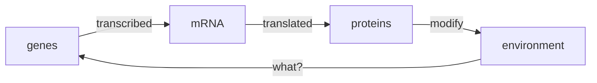
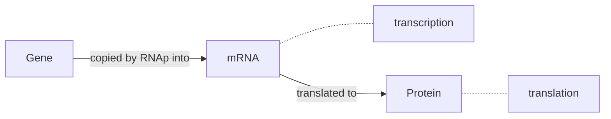

# Transcription Networks - Basic Concepts

The cell continuously monitors its environment and calculates the amount of each protein that is needed. The rate of production is controlled by **transcription networks.**

* To represent **environmental states**, cells use special proteins called **transcription factors** as *symbols*.
* Transcription factors are molecules that can rapidly switch between **active** and **inactive** molecular states, with rates determined by environmental factors.
* Transcription factors **bind to DNA** and regulate `read-rate` of genes.
* Transcription factors regulate their target genes to mobilize the appropriate protein response in each case.

**E. coli**: has an internal representation of about 300 degrees of freedom. Hence, it has 300 transcription factors.

## Transcription Network Model

* **Gene**: a stretch of DNA whose sequence encodes the information needed for production of a protein.
* **Transcription**: Gene is copied into a disposable mRNA molecule by RNA polymerase (RNAp).
* **Promoter**: The number of mRNA produced per unit time is controlled by a regulatory region of DNA that **precedes** the gene which is called promoter. It regulates the *chemical affinity* of the DNA to mRNA (opposite is a **Repressor**).
* Transcription factors can act as both: **activators and repressors.**
* Transcription factor proteins are themselves regulated by other transcription factors.

|  |  |
| ---------------------------------------- | ---------------------------------------- |

#### Representation of Network Nodes & Edges

* x → Y : Product of genes X is a promoter for the transcription of gene Y. 
* X ⟞ Y : Product of genes X is a repressor for the transcription of gene Y.

#### Mechanism of Transcription Networks

* The input of transcription factor network are **signals**. Each signal is a small molecule, protein modification or molecular partner that directly affects the activity of one of the transcription factors.

* The signal usually causes physical changes in the shape of the TF protein - *active* molecular state.

* Majority of the proteins are not transcription factors, rather they are building blocks or catalysts.

* Separation of Timescales:

  | Process                                                     | Timescale |
  | ----------------------------------------------------------- | --------- |
  | Input Signal changes Transcription Factor                   | ~msec     |
  | Binding of active Transcription Factor to DNA equilibration | ~sec      |
  | Transcription and Translation of the target genes           | ~minutes  |
  | Accumulation of the Protein Product                         | ~hours    |

* Hence, when considering network dynamics of protein levels, the transcription factor activity levels can be considered to be in steady state.

* Transcription networks are extremely **modular** in nature. (GFP from jellyfish) is widely used in experiments. Promoter of effect A + Gene of effect B → mechanism that causes a when B is true. **Promoters and genes are generally interchangeable.** This fact also means that these networks can evolve rapidly.

* The arrows in the transcription network evolve on a much faster timescale than the coding regions of the genes (time scale of many generations).

* Each transcription factor acts primarily in one mode for its target genes, as either an activator or repressor. However, the input mode of regulation [of a gene] is often mixed.

## Input Functions

* The strength of the effect of a transcription factor on a target gene is escribed by an **input function.**

* **X** regulates **Y** : the number of molecules of protein Y produced per unit time is a function of the concentration of X in its active form $X^{*}$.

* Rate of production $Y = f(X^*)$.

* A useful function that realistically describes many gene input functions is called the **Hill function.**
  $$
  f(X^*) = \beta\frac{X^{*n}}{\Kappa^{n} + X^{*n}}
  $$

* **K** : activation coefficient, which has units of concentration. It defines the concentration of active X needed to significantly activate expression.

* $X^* = K$ : half-maximal expression.

* $K$ is mainly determined by the chemical affinity between $X$ and its binding site on the promoter.  

* $\beta$ : maximal promoter activity. It is reached when $X^* \gg K$.

* The **Hill Coefficient** $n$ determines the steepness of the input function. For larger n, the function is more step-like.

* Usually, input functions are moderately steep: n=1-4.

* For a repressor, the hill function is a decreasing function.

* Hence, each arrow in the network can be thought to carry at least three numbers: $\beta, K, n$. These numbers can be readily tuned during evolution.

  * $K$ : Can be varied if the position of the binding site is changed.
  * $\beta$ : can be tuned by the mutations in the RNAp binding site.

* Laboratory evolution experiments show that when placed in a new environment, bacteria can accurately tune these numbers within several hundred generations to reach optimal expression levels. Thus, these numbers are under selection pressure and can heritably change over many generations if environments change.

* Many genes have a nonzero minimal expression level, called the gene's **basal expression level.** It can be described by adding a $\beta_0$ term.

* The essence of the input functio n is a transition between low and high values, with a characteristic threshold $K$.

* We can hence approximate the input function with a **logic approximation**. It can be expressed as :  $f(X^{  * }) = \beta\theta(X^{   * }> K)$.  It is equivalent to a Hill function with $n \rightarrow \infty$.

* For a repressor: $f(X^{   * }) = \beta \theta(X^{   *  } < K)$ .

* Multi-dimensional input functions:

  * $f(X^{   * }, Y^{   * }) = \beta\theta(X^{   *  } > K_x)\theta(Y^{   *  }> K_y)$  ~ X AND Y
  * $f(X^{    *  }, Y^{    *  }  ) = \beta\theta(X^{   *    } > K_x + Y^* > K_y)$  ~ X OR Y
  * SUM input function: $f(X^{   *   }, Y^{   *   }) = \beta_xX^{   *    }+ \beta_yY^{   *   }$.
  * More complex functions with many inputs...
  

## Dynamics & Response Time

---
