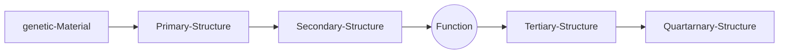

# Principles of protein structures

<center> by xxx </center>

+ Group research: Design of protein molecules for novel functional and behavioural activities. Also study proteins using variety of techniques like ML and computational design.


## Moplecular Interactions in Biomolecules

+ Non-covalent interactions modelled via Lennard-Jones, consists of **van der Waals interactions, hydrogen bonds.**
+ **Two neutral atoms in close proximity get polarised !**
+ Van der waals radius is **r1 + r2** and is the point where the repulsive interactions become dominent.
+ Hydrogen bonds can be thought of as a dipole-dipole interaction but on a molecular scale.
+ Iconic interactions are the strongest, however, water ions severly reduce electrostatic interaction.
+  In vacuum its ~50 kJ/mol, whereas in water its ~6 kJ/mol.

## Moleculaes of Life

1. Nucleic Acids
2. Proteins : Made of Peptides
3. Lipids : Fats
4. Glycans: Sugars



+ Proteins have an amino group, a carboxyl group, and 20 different kinds of R groups.
+ They are built out of 20 amino acids encoded in DNA.
+ The amino acids can be classified based on the type of Carboxyl group.
  + **Polar and non-polar amino acids**. Polar amino acids can form hydrogen bonds with itself and other amino acids. They are also hydrophobic.
  + **Negatively and positively charged amino acids**. Their sidechains are charged at pH=7.
+ Synthesis of protein: condensation reaction where amino acid of one ...TODO
+ The sequence of a protein is written from the N-terminus (one of the free $NH_3$)  to the C-terminius (the one with $COO^-$).
+ backbobne + sidechain + actual witten structure + carboxyl extension.
+ Hydrophobicity of amino acids is an important feature.
+ Residue: the central kernal of the proteins. **Find out why a Residue is called a residue. TODO**

+ Some amino acids are special:

  + Cysteine can form disulphide bridges.

    ```mermaid
    flowchart LR
    	Cysteine -."+".- Cysteine2(Cysteine) --Oxidation--> Cystine
    	Cystine --Reduction--> Cysteine2
    	
    ```

    

  + Glycine doesn't have a sidechain group.

  + Proline's sidechain group is covalently bound to the nitrogen of the peptide bond.

## Protein Secondary Structures

+ $\alpha$-helix form to stabilize the hydrophobic core. It forms by making H-bonds between Hydrogen and oxygen.
+ $\beta$-sheets form hydrogen bonds with its whole backbone.
+ Usually the alpha and beta sheets are sometimes misaligned and imperfect.

## Protein Tertiary Structure


