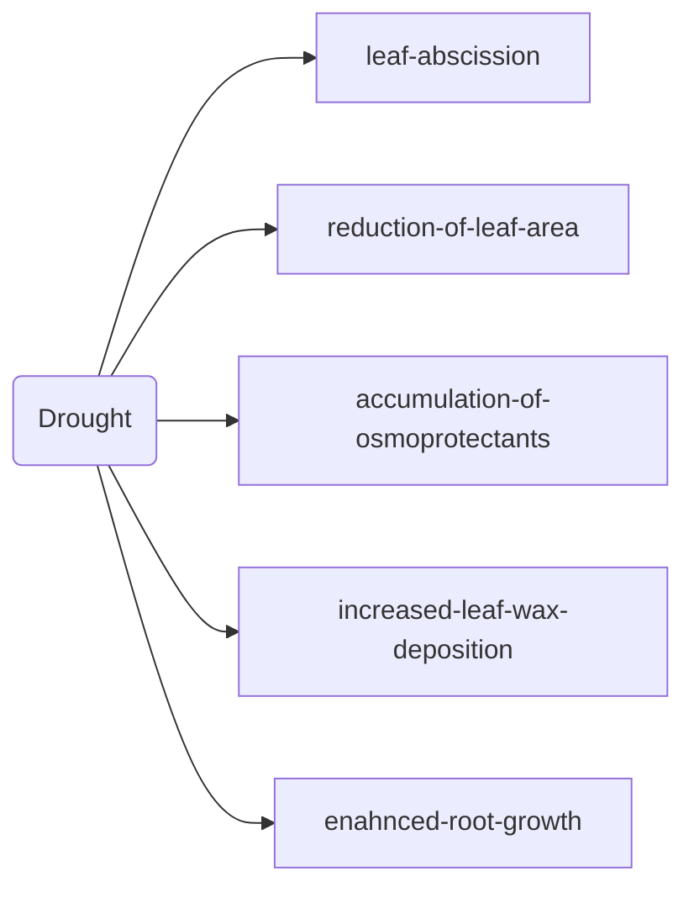

# Basics


+ Plants diverged from animals around 1.5 billion years ago.

+ How many genes does a plant have? : 20-25 thousand. 60% of genes are common among plants and animals.

+ How to transform a plant?

  1. Stable transformation with *Agrobacterium tumefaciens*. Infected plants produce tumors at the infrction site.
     + Transfer-DNA (T-DNA): Genes for biosynthesis of auxin and cytokinins.
     + Dip the flower in the solution containing the agrobacteria and now 1% of the seeds will be transgenic.

  2. Stable/transient transformation with the particle gun
     + Plasmid DNA bound to small gold particles (dia 1um) are shot to the plant tissue.
     + 3-4 gold nano-particles per cell is the flux. 24 hours later, you can see the transcription of the required protein.

+ How to understand a trait? (Identify genes involved in the trait)

  1. Forward genetics:

     + Screen for mutants showing altered trait behaviour.
     + Isolate gene that is defective in the mutant.
     + Study gene function.

     ```mermaid
     graph LR
     	subgraph 2.Insertion-Mutagenesis
     		B1(T-DNA from Agrobacterium, transposon) --> B2(Identify mutated gene by PCR of flaking DNA)
     	end
     	
     	subgraph 1.Chemical-mutagenesis
     		A1(Cause point mutations using EMS) --> A2(Identify mutated gene through genome sequencing/positional cloning)
     	end
     ```

  2. Candidate gene approach: Reverse genetics

     + CRISPR/CAS
     + RNA interference
     + identify a T-DNA insertion mutant from available T-DNA insertion lines

  3. Use natutally occuring genetic variation within species.

     + Using QTL (qunatitatice trait locus) - mapping

+ Plants survive harsh environments

  + Large environmental variations:
    1. Light conditions: shading-extreme light
    2. Temperature changes (-10° to 45°C)
    3. Water status: Drought-floods
    4. Mineral nutrients: deficiency-toxicity

+ Plants do respond to high ambient temperature to optimize photosynthesis, growth and development: **Thermomorphogenesis**.

+ <u>Note</u>: Hypocotyl is the stem. Specifically it is everything that grows below the germinating seed. Stuff above it is called endocotyl.

  + Steeper leaf angle is called **hyponasty** and is a phenotype that is amplified by rising temperature.

+ Thermomorphogenesis - benefits:

  + more distance of leaves from soil: less exposure to heat reflection from soil.
  + more open rosette: better cooling due to better air circulation.
  + Cooler leaves: mean higher photosyntheti efficiency.

+ Blue and red light photoreceptors that plants use to grow.

+ Red light activates Phytochrome B (PHYB). PHYB is a temperature sensitive light sensor. The higher the temperature, the less active PHYB. High temperature-phenotype (29°C ) gives a low light-phenotype.


# Introduction to plant responses to abiotic stress

<center>Paula Duque</center>


+ In plants, the development is **post-embryonic.** All the development in plants happen after the embroyonic stage. This is crutial for stress development.

  + For the same reason, the plant development is very plastic.
  + Developmental transitions: Light, Daylength, Temperature, $H_2O$, and Nutrients
  + 

+ Plant transitions from heterotrophy (can't produce its own food — seedling) to autotrophy.

+ Seeds don't germinate instantly to wait for seed dispersion. Enzymes that assert dormancy in seeds need to degrade for their germination.

+ Number of organs — Low Nitrogen conditions would trigger more roots, whereas, the opposite will trigger inverstment in the shoot of the plant.

+ Plant cells have very large vacuoles that are full of water.

  + Major driver of cell size
  + **Turgor Pressure**: everything that is not "woody" is supported by Turgor pressure.

+ Abiotic stress: stress agents that are non-living in nature.

+ Drought stress: cells increase salt concentration to hold water in the cells.

+ The epidermis needs to have chloroplastics in order to have stomata. Stomata exists in all plant tissues.

+ >Correct Bottom part of the leaf — Daxil & top part — Basil

+ Drought Response:



+ Stomatal movements control water loss. And is mediated by the plant hormone ABA (Abscisic acid). Increase in ABA — closes stoma. It also controls dormency in seeds.
+ Ethylene matures fruits. It is a gas and it spreads. It is also a stress hormone.


+ Plants respond to cold stress by indiucing the formation of unsaturated fatty acids.

+ Oxygen degradation (anerobic stress-induced proteins):

  + glycolysis and fermentation
  + ROS scavenging and signalling
  + ethylene biosynthesis

  

# Plant membrane transporters and their role in stress response

<center> Maria ...</center>

+ Siderophores chealte Iron and make them available for plants.
+ Transport across cell membrane:
  + Active Transport
    + Primary Active Transport
      + Hydrolyse ATP to produce movement
    + Secondary Active Transport
      + Use another substrate for transport
  + Some famous (in)famous transporters
    + CFTR (Cystic fibrosis)
    + GLUT1 (G1D)
    + Multidrug (antibiotic) resistance: the bacteria pumps out the drugs
+ Number of ion channel in plants is about half of in humans (mammals).

+ ABA is a master regulator of for Growth.
+ NaCl in soil. Ionic and osmotic stress together
  + $Na^+$ and $K^+$ imbalance
  + Osmotic stress
  + Increased ROS production
  + Impaired photosynthesis
+ Iron deficiency: pH is a major problem that causes Iron deficiency. Plants respond by acidifying the soil around them. 


# Introduction to Photosynthesis/C4 and CAM Photosynthesis

<center>Andreas Weber</center>


+ Removal of carbon requires energy equivalent to 15yrs of 2019 total energy consumption.

+ Challenges to plant science: Increase net primary productivity per unit land.
+ PlantACT! : aim is to fix the planet.
+ Calvin-Benson Cycle: has three stages and results in photosynthesis.
+ RubisCO is the most abundant protein on earth. And is important for photo-synthesis.


# Assignment Discussions


##  1. Which genes are involved in signal transduction and response? How to find them? [Monday]

+ GWAS:  Genome Wide Association Study and it can be used to quantify the abundance and location of genes in comparison to using QTL (qunatitative trait locus) , which just gives you the expression of the gene (its position on the genome).
+ We use EWS, a chemical mutagen to indiuce the mutations.
+ Mapping by Sequencing:
+ We sequence the mutated and look for particular mutated sites using GWASP.
+ Allelic vs non-allelic mutations: If the mutations are allelic, the first generation cross reverts to the wild type. If not, the first generation shows mutant phenotypes.
+ Rescue experiments in plants: Cross wild-type with overly expressed mutagenic specie.
