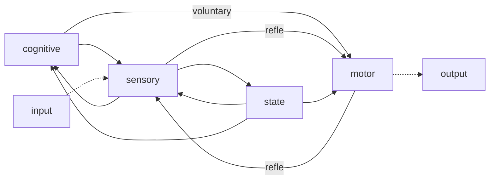

# Introduction to Neurobiology and Behaviour | Brain 3.0

 Rui Olivera

+ 5 things (recommneded) for discussion:

  + 10% of the brain
  + Creativity is in the right hemisphere
  + Dale's principle — neurons typically use one neurotransmitter and hence forms a good classifier.

  + Adult neurogenesis
  + Mozart effect — by making children listen to music, thier music skills can be improved.

+ Nervous system [simplex] — unoptimized solution by mermaid:

+ Reflexes act like ISRs (Interrupt Service Routines).
+ Allostasis: In a dynamiocal system, not all parameters can be acted upon to keep the system in homeostasis. In that case, the system introduces new set-points that can be realistically acheieved. This is called allostasis.

+ Brain-science revolutions:
  + brain 1.0 : neurons and synapses
  + brain 2.0: brains and associative memory
  + brain 3.0: biological minds

## Brain 1.0 : Neurons and Synapses

+ Brain is required for adaptation. If the environmental changes outpace the changes in the genetic material that causes viable responses; pure genetic adaptation is no longer a vaible option.
+ *Physarum polycephalum* : Smart behaviour in slime mold. It can solve mazes by exploring its environment by extending a network of cytoplasmic matter and leaving chemical trails — essentially doing a non-backtracking random walk.

## Neurons as computational units

+ Synapses:
  + Electrical 
  + Chemical
+ Axons have Myelin Sheaths have interruptions called nodes of Ranvier. The signal then jumps faster between the nodes. The distance between two such nodes has to be optimized for reliable transfer.
+ Two evolutionary scenarios for the evolution of neutrons:
  + Single-origin hypothesis: in some organisms there was a loss of nervous systems — **Homologous systems.**
  + Multiple origin hypothesis: neural abilities evolved in different organisms at different times — **Convergent Systems**.
+ Electrical code: Creation of an electrical code in neurons relies in 3 distinct modules of proteins:
  + **Ion homeostasis:** creates the potential energy for the action potential.
  + **Transduction:** transduces sensory and intercellular into electrical code.
  + **Propogation:** propagates the electrical signals along neurons.
+ Key tasks of neuronal ion homeostasis:
  + maintianing a negative voltage across the membrane to power action potentials — P-type ATPases
  + maintaining low levels of cytoplasmic $Ca^{2+}$, since it regulates intra-cellular communications.
+ Transduction. the first step in neural signalling:
  + Of the many protein families involved in transduction, only two are metazoan (multi-cellular) novelties.
+  Propagation: local electrical signals will attenuate over space.
  + To propogate over large distance, neurons use ion channels respond to voltage itself, called voltage-gated ion channels.
+ Action potentials are used across different biological systems to mediate processes:
  + Bacterial biofilms also use regenerative potential changes to coordinate colony growth,
  + etc...
+ Evolution of voltage-gated sodium channels:
  + The key change allowed this development was the evolution of voltage-gated sodium channles (Nav) from preexisting voltage-gated calcium channels (Cav).
  + $Na^+$ does not broadly triggert cellular signalling pathways as $Ca^{2+}$ does.
  + $K^+$ ion channels are then used for traspondence of signals across the neutron.
+ Chemical synapses and electrical synapses:
  + Electrical system is faster but the chemical one is more precise and cn be moduled in a variety of ways.
  + Each step of the chemical signalling can be moduled in Chemical signalling.
+ Evolution of synapse: synapses likely originated from cell junctions in early metazoans.

## The first brain: Enteric NS vs Central NS

+ All animals that have neurons have an EWS.
+ However, not all animals that have neurons have a CNS.
+ An ENS with similar features occurs in cnidaria [TODO] and bilateraa [TODO], but a CNS occurs only in bilateria (although not all).

## Brain 2.0 : Brains and Associative Learning

+ The hypotheses behind the **Cambrian Explosion**:
  + Because of low $O_2$ levels, the speed of movement was limited. 
  + Introduction of predation-prey dynamics required higher cognitive abilities.
+ Learning & Memory
  + Single Stimulus learning
    + Habituation
    + Sensitization
  + Stimulus-Stimulus learning
    + Pavslovian conditioning
  + Response-Stimulus learning
    + Operant conditioniong

## Brains 3.0 : Biological Minds

+ Brains can create huge contingency tables for faster computation.
+ Brains for virtual reality simulators
  + Simulate conseuences of actions without payiong costs
+ Mental time travel
  + Contrafactual thinking

# How to quantify behaviour?

Niccolò Bonnachi

+ >  Missing: 1 hour of lecture

  ---

+ FMRI: Can only quantify a binary activity parameter.
+ Behaviorial studies complement the lack of precision and dimesnionality in the current measurment techniques.
+ Dopamine neurons report an error in the prediction of reward.
+ Purposive behaviour
  + Edward Chance Tolman — action in the context of outcome.
  + Latent learning: Learning without the explicit context of learning

## A slightly more complex navigation task

+ Rodents have 10X olefactory sensors in comparision to humans.
+ Liquid dilutions and air dilutions are equivalent in terms of animal behaviour olfaction.
+ 

