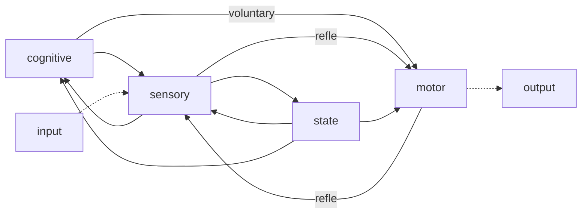
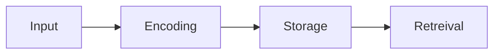
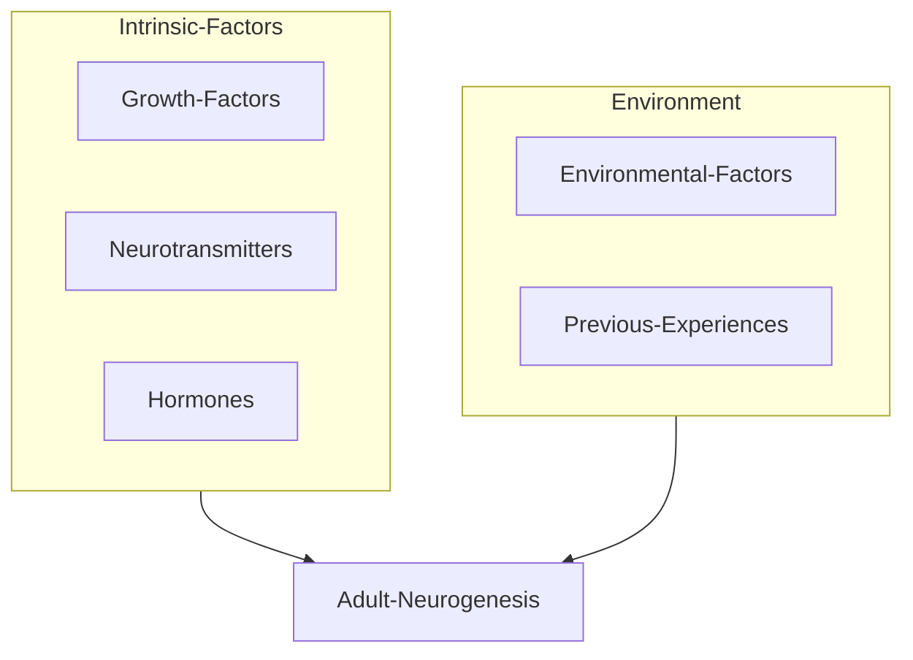
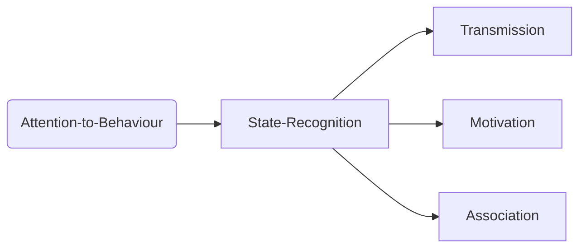

# Introduction to Neurobiology and Behaviour | Brain 3.0

 Rui Olivera

+ 5 things (recommneded) for discussion:

  + 10% of the brain
  + Creativity is in the right hemisphere
  + Dale's principle — neurons typically use one neurotransmitter and hence forms a good classifier.

  + Adult neurogenesis
  + Mozart effect — by making children listen to music, thier music skills can be improved.

+ Nervous system [simplex] — unoptimized solution by mermaid:

+ Reflexes act like ISRs (Interrupt Service Routines).
+ Allostasis: In a dynamiocal system, not all parameters can be acted upon to keep the system in homeostasis. In that case, the system introduces new set-points that can be realistically acheieved. This is called allostasis.

+ Brain-science revolutions:
  + brain 1.0 : neurons and synapses
  + brain 2.0: brains and associative memory
  + brain 3.0: biological minds

## Brain 1.0 : Neurons and Synapses

+ Brain is required for adaptation. If the environmental changes outpace the changes in the genetic material that causes viable responses; pure genetic adaptation is no longer a vaible option.
+ *Physarum polycephalum* : Smart behaviour in slime mold. It can solve mazes by exploring its environment by extending a network of cytoplasmic matter and leaving chemical trails — essentially doing a non-backtracking random walk.

## Neurons as computational units

+ Synapses:
  + Electrical 
  + Chemical
+ Axons have Myelin Sheaths have interruptions called nodes of Ranvier. The signal then jumps faster between the nodes. The distance between two such nodes has to be optimized for reliable transfer.
+ Two evolutionary scenarios for the evolution of neutrons:
  + Single-origin hypothesis: in some organisms there was a loss of nervous systems — **Homologous systems.**
  + Multiple origin hypothesis: neural abilities evolved in different organisms at different times — **Convergent Systems**.
+ Electrical code: Creation of an electrical code in neurons relies in 3 distinct modules of proteins:
  + **Ion homeostasis:** creates the potential energy for the action potential.
  + **Transduction:** transduces sensory and intercellular into electrical code.
  + **Propogation:** propagates the electrical signals along neurons.
+ Key tasks of neuronal ion homeostasis:
  + maintianing a negative voltage across the membrane to power action potentials — P-type ATPases
  + maintaining low levels of cytoplasmic $Ca^{2+}$, since it regulates intra-cellular communications.
+ Transduction. the first step in neural signalling:
  + Of the many protein families involved in transduction, only two are metazoan (multi-cellular) novelties.
+  Propagation: local electrical signals will attenuate over space.
  + To propogate over large distance, neurons use ion channels respond to voltage itself, called voltage-gated ion channels.
+ Action potentials are used across different biological systems to mediate processes:
  + Bacterial biofilms also use regenerative potential changes to coordinate colony growth,
  + etc...
+ Evolution of voltage-gated sodium channels:
  + The key change allowed this development was the evolution of voltage-gated sodium channles (Nav) from preexisting voltage-gated calcium channels (Cav).
  + $Na^+$ does not broadly triggert cellular signalling pathways as $Ca^{2+}$ does.
  + $K^+$ ion channels are then used for traspondence of signals across the neutron.
+ Chemical synapses and electrical synapses:
  + Electrical system is faster but the chemical one is more precise and cn be moduled in a variety of ways.
  + Each step of the chemical signalling can be moduled in Chemical signalling.
+ Evolution of synapse: synapses likely originated from cell junctions in early metazoans.

## The first brain: Enteric NS vs Central NS

+ All animals that have neurons have an EWS.
+ However, not all animals that have neurons have a CNS.
+ An ENS with similar features occurs in cnidaria [TODO] and bilateraa [TODO], but a CNS occurs only in bilateria (although not all).

## Brain 2.0 : Brains and Associative Learning

+ The hypotheses behind the **Cambrian Explosion**:
  + Because of low $O_2$ levels, the speed of movement was limited. 
  + Introduction of predation-prey dynamics required higher cognitive abilities.
+ Learning & Memory
  + Single Stimulus learning
    + Habituation
    + Sensitization
  + Stimulus-Stimulus learning
    + Pavslovian conditioning
  + Response-Stimulus learning
    + Operant conditioniong

## Brains 3.0 : Biological Minds

+ Brains can create huge contingency tables for faster computation.
+ Brains for virtual reality simulators
  + Simulate conseuences of actions without payiong costs
+ Mental time travel
  + Contrafactual thinking

# How to quantify behaviour?

Niccolò Bonnachi

+ >  Missing: 1 hour of lecture

  ---

+ FMRI: Can only quantify a binary activity parameter.
+ Behaviorial studies complement the lack of precision and dimesnionality in the current measurment techniques.
+ Dopamine neurons report an error in the prediction of reward.
+ Purposive behaviour
  + Edward Chance Tolman — action in the context of outcome.
  + Latent learning: Learning without the explicit context of learning

## A slightly more complex navigation task

+ Rodents have 10X olefactory sensors in comparision to humans.
+ Liquid dilutions and air dilutions are equivalent in terms of animal behaviour olfaction.

# The evolution of brains and cognitive abilities

Alexander Kotrschal

+ Guppies as a model system.
+ Linear trend of Relatver brain size and weight on log-axes.
+ Skull width is a good indicator of brain size in birds.
+ Lefebvre et al correlated Cognitive beneefits and brain sizes and saw a positive correlation.
+ **Expensive Brain hypothesis**: Aiello & Wheeler 1995 Current Anthropology
  + Tradeoff between Relative Brain Mass and Relative Gut Mass
  + Tradeoff is between two "expensive" tissues.
+ There is also positive correlation between brain size and (spawning site density and sex ratio)
  + Reason: TODO
+ Experiment: TODO
  + 11-15% brain size difference
  + But similar body sizes
  + Driven by Angst-1 expression
+ **Angioprotein 1**: Promotes angiogenesis (wikipedia: Angiogenesis is the physiological process through which new blood vessels form from pre-existing vessels, formed in the earlier stage of vasculogenesis.)
+ Important: Fish have life-long neurogenesis.
+ First tests for Cognitive abilities:
  + Numeric Learning
    + Large-brained females learns better
    + Male fishes learn "equally bad".
    + Large-brained females are better at reversal learning.
  + Brain size and survival: 

    + "Large Fish Collider Vienna"
    + Predator Inspection — side swimming motion that they use to scan large field of view. 
      + Maybe also signals the predator that it has been spotted by the prey and a surprise attack would not work.
      + Small-brained fishes inspect longer, and across wider distances.
    + Brain size and conflict resolution:
      + They are territorial and would recognize a confined space as their territory.
  + Large-brained femaled prefer more colourful males, and vice-versa.
+ Optomotor Test: Put stripes in the field of view (a cylinder) — move it, and the eye follows it with a reflex action.
  + This test can be used to figue out the miniumum resolvable resolution, by varying the size of the stripes.
  + [Opsin](https://en.wikipedia.org/wiki/Opsin) gene expression + Optomotor test can be used to test color sensitvity.
+ Are small-brained guppies 'bad guppies'?
  + Small-brained fishes:
    + Similar body condition
    + Similar swimming abilities
    + Faster juvenile growth
    + Similar adult size
    + Similar digestive efficiency
    + More offsprings
    + Better innate immunity
    + Survive longer
  + Small-braines individuals live longer **when kept individually.**
  + Predation vs brain size:

# Post-doc Project I: Genetics and evolution of social behavior in *Drosophila* and zebrafish

Susana Varela

+ Introduced Drosophila to Rui's lab.
+ Learning by watching or passive learning is called social learning. It is not the same as community learning. The learner does not experience the task itself, just observes and perceives it.

## Environment complexity and the evolution of social behaviour and social cognition

+ Addition of same agents to a single food source will increase the cognition compleity of the foraging task — Environmental complexity.
+ What is a non-social interaction? : Non-cooperation is non-social. (lecturer's opinion)
+ Neural and psychological mechanism of information:

+ Adequete cognitive abilities are a sum of : **Social and Non-social competence.**
+ The social intellegence and social brain hypothesis posit that group living generates the selective forces that drive the evolution of enhanced cognitive abilities and brain size.
  + General-purpose cognitive mechanism has **strong selective pressure** on **social behaviour**.
  + The available evidence supporting these hyposthesis is still scarce.
  + All evidence for this hypothesis has been based on comparative studies.
+ All fishes prefer circles (control) but Shoal selected lines prefer shoals more than non-seleceted lines.

# Post-doc Project II: Social modulation of adult neurogenesis in zebrafish

Magda Teles

+ The dogma: nerve cells don't regenerate in adults. The dogma died.I
+ Different prolifereation in different organismic species. In fishes, all the brain regions are proliferated. Zebrafishes continue to grow during their lifetime, hence, they need neurogeneration. 16-different proliferated across the brain were recognised. 

## Adult neurogenesis

### Regulation

+ There is a tendency for the dominent animals to have more proliferation than the subordinate animals.
+ Cortisol was shown to control this proliferation. The presence of cortisol itself is linked to the position of the animal in its social hierarchy.
+ The effects of the social environment were independent of circulating cortisol levels.

# Post-doc Project III: Evolutionary conserved role of oxytocin on social fear contagion in zebrafish

Kyriakos Kareklas

+ Ekman characterised behaviours by using the domain level of anatomy, social context, mehxnaics, etc
+ Do other animals show expressions in such a way?
+ Social Contagion of Valenced states
  + Face: Contagion when yawning
+ Mechanisms of contagion
  + Oxytocin: its activity is conserved across a set of social behaviours.

+ Allogrooming is a metric for consolation in animals.

# Brain development and plasticity

Gil Levkowitz

+ The hypothalamus regulates homeostasis by sensing and adjusting physiological states via two primary modes of actions.
+  Secretion of neuropeptides into the vascular of the pituitary/medium reinforces breast feeding in mammals.
+ Chronology of gross morphological changes which occur throughout the formation of the CNS
  1. A portion of the dorsal ectoderm is specified to form neural-ectoderm (**neural plate** formation)
  2. formation if neural tube (**Neurulation**) 
  3. TODO

## How distinct types of neurons are form?

+ Neural progenitors acquire their identity according to their site of origin (embryonic position) in the CNS.
+ Morphogen: TODO
+ Neural specification represents an extrinsic -> intrinsic transitions in which neurons differentiate ans lose their potential to re-enter the cell cycle.
+ 
