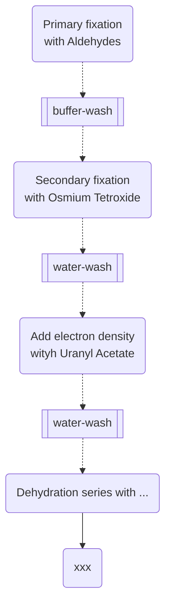

# Introduction

+ Three steps for approval of project involving animals. Each step takes approx. 1 month.

  ```mermaid
  graph LR
  	Pre-submission --> ORBEA-->DGAV
  ```

+ ORBEA: Animal welfare body

+ DGAV: Portugese government organisation that licences facilities.


+ They have 50 year old preserved embryos.

+ Plant Model organism: [*Nicotiana benthamiana*](https://en.wikipedia.org/wiki/Nicotiana_benthamiana).

+ Gnotobiology comprises **the study of germfree plants and animals, as well as living things in which specific microorganisms, added by experimental methods, are known to be present**.

+ Metabolic cage: readout-rate is about 1 Hz. Food, water intake; body weight; $O_2$ intake, $CO_2$ output, etc are tracked.


# Transgenic Units

## Mice Facility

+ Embryonic stem cells (ESCs) are **found in the inner cell mass of the human blastocyst, an early stage of the developing embryo lasting from the 4th to 7th day after fertilization**. In normal embryonic development, they disappear after the 7th day, and begin to form the three embryonic tissue layers.
+ Gene insertion:
  + A *transgene* is a gene that has been transferred naturally, or by any of a number of genetic engineering techniques, from one organism to another.
  + linear BAC vectors (can harbour upto 350kb gene sequence) — more specific insertion of the gene in the host embroyo genome.


# BE $\mu$FAB

## 3D Printing:

+ Material Extrusion: Fused Filament Fabrication (FFF)
+ Photopolymerisation Stereolithography (SLA) — Resin Printer

+ PEEK (Polyether ether ketone) — very resistant to heat and chemical erosion.
+ OpenSCAD: Has a freely integrated terminal interface.
+ Specific Bed and Nozle temperatures are defined for different materials.

## Microfluidics

### Flow Control Systems

+ **Peristatic Pumps**: sets up large flow rates. The flow rates are not constant due to constant work on the tube.
+ **Syringe Pumps**: Recommended use with glass syrenges which have Teflon plungers.
+ **Pressure driven pumps:** No oscillation flow. 0.005% stability. Pressure limited to 8 bars. ~20-30k€.
+ **Valves**: injector, selector, and matrices. 


# Flowcytometry

+ The cells must be in suspension for flow cytometry measurement.

+ Scale of measurement: 200nm (Nano-scale Cytometry) to 20-30$\mu$m.

+ **Forward Scatter** measures the size of the particle using Diffusion Light Scattering.

+ **Side Scatter** measures the granularity of the cells.

+ What kind of detectors/filters is used in FC Cytometry? — An array of filters.

+ Sorting: ~4% sorting error and 4-way sorting is available at IGC.

+ > >  TODO: There are dyes that intercalate the DNA: **ethidium bromide**.


# Advanced Imaging


+ PPBI: Portugese plateform for bioimaging & EuroBioImaging.
+ Phase contrast microscopy: Fritz Zernike received the Nobel Prize for it. Zeiss commercialised it.
+ NA: Numerical Aperature
  + High NA has a higher resolution.


# Electron Microscopy

+  Aldehydes — Glutaraldehyde and formaldehyde are used in a cocktail mix. Formaldehyde is a reversible fixative. With Glutaraldehyde, the fixation is permanent but slow.




+ CLEM: Correlative Light and Electron Microscopy
  + Concurrent Light and Electon microscopy. 
  + Two protocols: Pre-embedding and Post-embedding.
+ Five kinds of EM:
  1. Serial Section TEM
  2. Serial TEM Tomography
  3. Array Tomography
  4. Serial Block Face SEM
  5. Focused Ion Beam SEM


# Genomics

+ Whole Genome Sequencing Cost: ~250,000$

+ Transcriptomic reads are done by reading the RNA.
+ 
