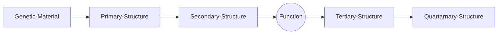

# Principles of Protein Structures

<center> by Casper Goverde </center>

+ Group research: Design of protein molecules for novel functional and behavioural activities. Also study proteins using variety of techniques like ML and computational design.


## Moplecular Interactions in Biomolecules

+ Non-covalent interactions modelled via Lennard-Jones, consists of **van der Waals interactions, hydrogen bonds.**
+ **Two neutral atoms in close proximity get polarised !**
+ Van der waals radius is **r1 + r2** and is the point where the repulsive interactions become dominent.
+ Hydrogen bonds can be thought of as a dipole-dipole interaction but on a molecular scale.
+ Iconic interactions are the strongest, however, water ions severly reduce electrostatic interaction.
+  In vacuum its ~50 kJ/mol, whereas in water its ~6 kJ/mol.

## Moleculaes of Life

1. Nucleic Acids
2. Proteins : Made of Peptides
3. Lipids : Fats
4. Glycans: Sugars



+ Proteins have an amino group, a carboxyl group, and 20 different kinds of R groups.
+ They are built out of 20 amino acids encoded in DNA.
+ The amino acids can be classified based on the type of Carboxyl group.
  + **Polar and non-polar amino acids**. Polar amino acids can form hydrogen bonds with itself and other amino acids. They are also hydrophobic.
  + **Negatively and positively charged amino acids**. Their sidechains are charged at pH=7.
+ Synthesis of protein: condensation reaction where amino acid of one ...TODO
+ The sequence of a protein is written from the N-terminus (one of the free $NH_3$)  to the C-terminius (the one with $COO^-$).
+ backbobne + sidechain + actual witten structure + carboxyl extension.
+ Hydrophobicity of amino acids is an important feature.
+ Residue: the central kernal of the proteins. **Find out why a Residue is called a residue. TODO**

+ Some amino acids are special:

  + Cysteine can form disulphide bridges.

    ```mermaid
    flowchart LR
    	Cysteine -."+".- Cysteine2(Cysteine) --Oxidation--> Cystine
    	Cystine --Reduction--> Cysteine2
    	
    ```

    

  + Glycine doesn't have a sidechain group.

  + Proline's sidechain group is covalently bound to the nitrogen of the peptide bond.

## Protein Secondary Structures

+ $\alpha$-helix form to stabilize the hydrophobic core. It forms by making H-bonds between Hydrogen and oxygen.
+ $\beta$-sheets form hydrogen bonds with its whole backbone.
+ Usually the alpha and beta sheets are sometimes misaligned and imperfect.

+ **Alpha-helix**
  + In the alpha-helix, the carbonyl oxygen of residue "i" forms a hydrogen bond with the amide of the residue "i+4".
  + There are only right handed alpha-helixes, except for a handful of exceptions.
+ **Beta-sheets**
  + Can be wither parallel and antiparallel. They have roughly the same binding energy.
  + In a beta-sheet, carbonyl oxygen and amides form hydrogen bonds between the strands, i.e between amino acids  far away from each other in primary sequence.
+ Proteins can be composed of one of the two secondary structures or be mixed.

## Beyond Secondary Structures

+ The tertiary structure, which is the three-dimensional organisation of the secondary structure elements. It is also referred to as the **protein fold**.
+ Quaternary structures refers to the association of different polypeptide chains (subunits) into a multinumeric complex.
+ Protein domains are fundamental units of tertiary structue. it forms an independnt structural domin. They are often units of function.
+ Domains have the same fold yet different amino acid sequences.
+ Protein domains are very stable to mutations. ANd they have been selected via evolution for the very specific reason.
+ The stability of the folded structure results primarily from the hydrophobic regions folding in together.
+ Two proteins with different sequences can have the same sequence.

## Conformations and Folding

+ Protein conformational changes does not require breaking bonds.
+ The peptide bond has partial double bond character and therefore are sterically hindered.
+ Protein folding induces conformational changes in the backbone. The backbone torsion angles $\phi$ and $\psi$ determine that conformation of the protein chain.
+ The Ramachandran diagram define the restrictions on backbone conformation.
+ $\psi$ : TODO 
+ $\phi$ : TODO
+ L: Left handed helix
+ You see a lot of Glycines in loops as they are flexible because of the absence of any side chains.
+ Prolines are in Cis conformation so they ususally "kink" the alpha-helix. Not generally found anywhere else.
+ Secondary structural elements are conected to form simple motifs. Given motifs, you can create many folds.
+ The interactions between the atoms in a protein control the folding of the protein into a well defined structure (native structure): **Thermodynamic hyposthesis of protein folding**. It was demonstrated by the famous Anfinsen Experiment which opened the folded structure of a protein and allowed it to relax in a controlled manner to recover the folded structure,
+ This information is encoded in their amino acid sequence.


# Evolution and Protein Structure

<center> by Casper Goverde </center>

+ > Reading Suggestion: The Molecules of Life (Chapter 5)

+ Protein structures are conserved during evolution while amino acids vary.

+ Motifs that are crutial for protein folding are conserved during evolution.

+ You can use protein globins to classify species at the molecular level.

+ Due to different selection pressures amd line seperation, protein sequences diverge between species.


