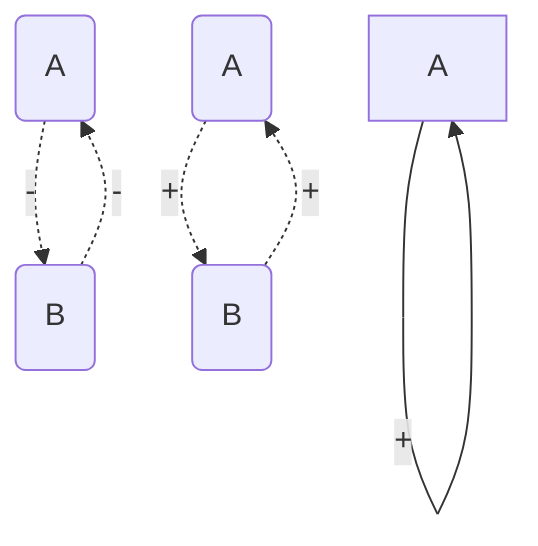

# Introduction

<center>Jorge Carniero</center>


+ Project multidimesntional things in lower dimensions.

+ `GeneSim`

+ > > Read: Can a biologist fix a radio? Or, what I learned while studting apoptosis by Yuri Lazebnik

+ > > Read: The evolution of molecular biology into systems biology: Westerhoff & Palsson

+ > > Read: D'Arcy Wentworth Thompson, one of the first persons to write a book on mathematical biology. The title is "On Growth and Form".

+ > > Lookup: Macy Conferences

+ Andrew Huxley and Alan Hodgkin Made a neuron equivalent circuit that fits beautifully fits the data they aquired.

+ > > Read: The chemical basis of Morphogenesis: Alan Turning

+ A theory of biological pattern formation: Gierer and Reinhardt (1972)

+ > > Read: Models of Biological Pattern Formation by Hans Meinhardt


## Flux balance Analysis (FBA)

+ Exchange fluxes and Internal fluxes.

​	


+ Metabolic Control Analysis (MCA): All flux control coefficients must sum to the unit. The flux control coefficient of an enzyme is a system property and not a characteristic of the enzyme.

---


# Modelling of Multicellular Systems


+ Keller-Segal model for slime molds.
+ Excitable Media: 
+ Hodgkin-Huxley model for neutron membranes is extremely complex. FitzHugh-Nagumo model is a simpler model.
+ 


# Modelling insights into T cell development in the thymus

<center> Camila Ramos</center>

+ Set of methodologies to assess progenitor/progeny relationships.
  + Cre/Lox system: Cre is an enzyme. Insert somewhere...
  + Cre is under the control of a promoter that is biologically relevant for the case-study
  + Cre acticirt mediates the somatic recombination of a ubiquitously expressed reporter locus.
+ Cells that have a history of Cre expression are fluorescently labeled.
+ A population can be the direct progeny of another and only if the percentage of florescent cells in the progeny is at least as large as in the progenators.
+ $p > d$ is equivalent to $d = p -a,\space a > 0$.


# Systems Biology of Molecular and Cellular Networks

<center>Attila Csikász-Nagy</center>


+ Cell cycle clock is coupled to the Circadian clock because of the common WEE1 expression, which is controlled by the circadian clock cycle.

+ In organolloids too, we see a circadian rhythm. The cells are not synchronous, but synchronous behaviour can be induced.

+ Feed-forward loops act as low pass filters.

  ```mermaid
  flowchart LR
  	X --> Y
  	X --> XY
  	Y --> XY
  	XY --> Z
  
  ```

+ Ageing correlates with protein aggregation in Yeast cells. During the cell division of yeast, the mother cells keep all the junk. And a few generations down, this waste builds up and the mother dies.

+ The cell cycle is also controlled by chaperones.

+ Food deprivation extends lifespans in general, if the organism is fully developed.


## Predicting Protein Complexes

+ Cytocast: a startup: Simulated cells to shape the future of medicine.


# Boolean networks approach to systems biology

<center>Pedro Monteiro</center>

+ State transition graphs (STG)
+ Attractors: correspond to (biologically relevant) asymptotic behaviours
  + **Stable state:** all gene levels are maintained. e.g. differentiated states, death,...
  + **Complex attractors:** long-lasting oscillatory behaviour. e.g. cells
+ Inherently Non-ergodic systems: will the initial state lead to the final state?
+ **GinSim**: You can also annotate arrows with papers. www.ginsim.org/model_repository
+ Stste transition graphs are not practical for most applications for addressing the complexity of current problems.
+ Necessary condition for instability (or multi stability) is the ocorrance of a positive feedback loop in the regulatory network. Motifs for bistability:



+ Trap spaces: stable patterns/hypercubes, such that *hypercube h:*
  $$
  \forall\cross h, f(x) \in h
  $$

+ 

+ Strongly Connected Components (SSC graph): Grouping a set of nodes into a high level node, when they form an orbit.

+ In the absence of kinetic knowledge, many alternative trajectories are possible.

+ Temporal Logic: Formalism for describing sequences of transitions between states in a reactive system

  + CTL . Computational Tree Logic (branching-time)
  + LTR - Linear Temporal Logic (linear-time)
  + CTRL - Comutational Tree Regular Logic

+ > > Consortium for Logical Models and Tools

+ > > PhysiBoSS : Mechano-cell biology
