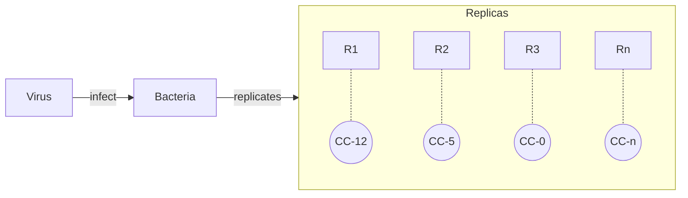

# An Introduction to the Luria-Delbruck Experiment

 by Marco Fumasoni 

## Introduction

+ Salvatore Edoardo Luria from Turin, Italy & Max Ludwig Henning Delbruck from Berlin, Germany fled to the United States.
+ Delbruck was a Physicist.

### Scientific background in the early 40s

+ Genetic information is heritable.
  + Due to DNA and DNA is genetic material.
+ Evolution
  + by inheritance of acquired characteristics
  + natual selection by Darwin
  + ... and modern synthesis

### The Problem: bacterial cultures rapidly develop resistance to viral infection

+ **H1:** The virus directly induces resistance mutations. "The environment induces the mutations required for survival."

+ **H2:** Mutations arise spontaneously before virus exposure.

+ To resolve this disjunction, we have to use a quantitative approach.
+ Note: CC refers to Colony Count

### Measuring mutation rates: Fluctuating numbers

+ Have $n$ replicates, and do the experiment: what you get is fluctuating results. The **colony counts** fluctuates widely.
+ Luria finds inspiration from a casino slot machine.
+ Luria´s intuition: if the mutation happens early on, i.e. if the petri dish is "lucky", you get a higher colony count, since more bacteria offsprings survive.

### Measuring mutation rates: distributions

+ Mutation events [mutation number n per culture] follow a **Poissonian curve**.
+ The **L-R distribution** derives the number of mutant cells.

### The model: *S. Cerevisiae*

+ Genome size: 12.5 MB, #TODO

### The system

+ Point mutation (uro3, CAN1)
+ The method is called Gross chromosomal rearrandement. The second leg of the experoiment will have Chromosomal loss.

+ The plan: Fluctuation vs quick and dirty
  + We use a 96 sample plate and do parallel platting events.
  + An alternative is a 6 replica experiment. It allows use to reduce the number of replicas. It drastically reduces the number of experiments we need to do as we need to analyse multiple generations.
+ **Generational Fitness:** 

### 

## Bonus

+ Clustered mutations look the same as early mutations: this situation is called **un-determination.**
+ Single genes result in Mendelian diseases. Polygenic diseases depend on multiple genes.

## Experiment

### Controls

