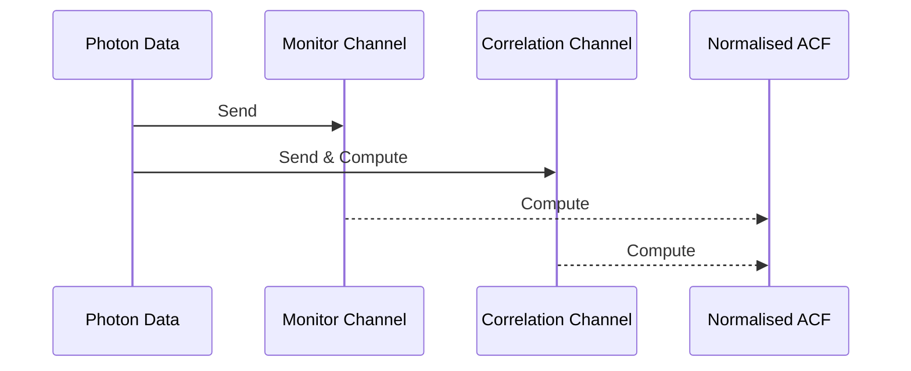

# Correlator Theory[^version 1]

<div style="text-align: center">by Yatharth Bhasin</div> 


## Introduction

This article introduces and explains the implementation of Correlation modules that can read a time series and compute the *autocorrelation function* for the said time series.

The autocorrelation calculation is done for a set of *lag time values*, this set is also referred to as the *Channels* of the Correlator module. Hence $ACF(k) \space or \space G(k)$ refers to the $k^{th}$​ channel.

The software module that manages the correlation is treated as a separate object entity. That means, each instance of the module completely describes the *acquisition, calculation, and output* of the data as required for a time series. All the different correlator modules, except the `Logarithmic_Correlator` derive from a base class called the `Linear_Correlator_Base`. This class defines a series of operations (functions) that are implemented by all different linear correlators types. 

The subsequent sections will explain the simple model used - *Simple Correlator System*, then explain the different correlation module designs.

## Introduction to Sources[^Incomplete]

The primary sources used for this article and the code development are listed in this table:

| S. No. |                    Author                    |                            Title                             | Year | Publication                | Link                                                         |
| :----: | :------------------------------------------: | :----------------------------------------------------------: | :--: | :------------------------- | :----------------------------------------------------------- |
|   1    |                    Yi Lug                    | Real Time Multiple Tau Autocorrelator and its application in dynamic light scattering - Massey University | 1996 | Thesis                     | -                                                            |
|   2    | Klaus Schätzel , Martin Drewel & Sven Stimac | Photon Correlation Measurements at Large Lag Times: Improving Statistical Accuracy | 2007 | Journal of Modern Optics   | https://www.tandfonline.com/doi/abs/10.1080/09500348814550731 |
|   3    |         Davide Magatti & Fabio Ferri         | Fast multi-tau real-time software correlator for dynamic light scattering | 2001 | Optical Society of America | -                                                            |
|        |                                              |                                                              |      |                            |                                                              |

## Ubiquitous Language Defined

This section defines terms that should be used consistently across documentation, code, and general discussions about the project.

| Entity                      | Notation | Description                                                  |
| --------------------------- | -------- | ------------------------------------------------------------ |
| Gate time of counter module | TTL-gt   | This is the time interval during which the counter module counts the TTL pulses and accumulates them. TTL-gt is also the minimum resolution of time available for autocorrelation calculation. |
|                             |          |                                                              |
|                             |          |                                                              |

## Simple Correlator System


 

The counter module is responsible for counting the pulses with a *gate time  $TTL-gt$​​​​​​*.

As soon as the sample time $TTL-gt$​ is over, the *PI-t (Periodic Interrupt timer)* signals a transfer of the collected photon counts to the *Data Processing Unit (DPU)*. It should be noted here that during the transfer of data from the counter module to the DPU — the counter is inactive until the transfer is done and the counter is reset for the next counting interval. This **dead time $t_{d}$​​​ ** gives rise to an error.
$$
Error = counting \space dead \space time / sampling \space time * 100\%
$$
==It might be possible to estimate this dead time by analyzing the clock cycles used by the transfer function.==

It is also essential that the time required for the computation of datum passed by the Counter to the DPU is less than the gate time $TTL-gt$​​​. This is because the DPU needs to complete the computation and be ready to receive the next block of datum which arrives after passage of another gate interval $TTL-gt$​​​​​​​ (This point is also emphasized in Magatti & Ferri, 2001).

**Hence, any implementation of a Correlator module that models the above schematics, must satisfy the following conditions:**

1. The dead time during transfer $t_{d}$ must be small enough such that the loss is insignificant to the statistics — as photon TTL pulses will be missed during that period.
2. If the DPU processes data in real time, the time for computation $t_{c} < TTL-gt$​. And practically $t_{c} << TTL-gt$​


## Autocorrelation Theory


### Mean Photon Statistics

We can formulate *Intensity $I$* as the number of photons reaching the detector in unit time.

The mean number of detected pulses ($\mu$​) per sample time $\Delta T = TTL-gt$​  is given in terms of the *Intensity $I$​*, *quantum efficiency $p_{det}$​ of the detector*  , which is *(detected photons / arrived photons)* 
$$
\begin{align}
\langle n \rangle = \mu &= p I \Delta T\\
\langle n_{j} \rangle = \mu_{j} &= p \int_{(j-1)\Delta T}^{j\Delta T}{I(t) \space dt}\\
\end{align}
$$

The computation of this mean is trivial and is performed in the DPU in the so-called *monitor channels.* **A monitor channel keeps track of the mean number of photons that arrive in a fixed gate time $TTL-gt$​​.** 

### Autocorrelation function

The autocorrelation function can characterize the "memory" of a timeseries. The amplitude of the timeseries is usually randomly distributed, however,  the recurrence of these fluctuations have a characteristic time scale that characterizes the memory of the system. 

Multiple definitions of the correlation functions are possible based on the factors like normalization scheme and noise corrections. We enlist the basic definitions used in our case.   ==TODO: Include Pearson's autocorrelation==

We first define the raw linear autocorrelation estimator:
$$
G_{le}(k) = \frac{1}{M}{\sum_{i=1}^{M}{n_{i}n_{i-k}}}
$$
Here, $M$ is the total sample size and $n_{i}$ represents photon counts which in turn represents Intensity. Hence $n_{i} \approx I_{i}$. This estimator  estimates the real autocorrelation function ($G_{n}(k)$) which assumes that $M → \infin$,  hence,  $\langle G_{le}(k) \rangle = G_{n}(k)$.

The use of the raw estimator with or without normalization is restricted to cases where the whole set $n_{i}$​ is available such that $n_{i-k}$ is a defined entity. Hence, this scheme is not fit for *real-time acquisition and calculation.*


#### Restructuring in terms of real time parameters

We say that for time $m$​, $0 \leq m < M$​, the $m^{th}$​ acquisition is made. Hence, at time $m$​, $n_{m}$​ is available and the *<u>available sample size of photon counts</u>* is also $m$​​.

The ACF Channels at any acquisition time $m$ represents the quantity :
$$
Ch(k) = {\sum_{i=0}^{m-k}{n_{i}n_{i-k}}}
$$
To acquire the  ACF from the correlator module, which is equivalent to acquiring the complete set of available Channels, ==a normalization must first be performed on the whole channel==. 

This scheme yields the ==*fundamental ACF*== equation :
$$
G(k) = \frac{\sum_{i=0}^{m-k}{n_{i}n_{i-k}}}{(Norm)}
$$
Note the presence of the time dependent parameter $m$. It can be inferred from the above equation that for different values of the lag time $k$, the summation operations differ. For $k = 0$, $m$ sums are performed. And for $k = m - 1$, just one sum is performed. This is an artifact of the real time averaging, which is referred to as **triangular averaging.** Distortions that result from this triangular averaging can be estimated and can be managed. The schematic below illustrates the arrival of photon datum and its subsequent distribution to the different channels. This is due to the fact that complete $n_{i}$ series is not available for the ACF calculation and hence the relation $\langle n_{i}n_{i-k} \rangle = \langle n_{i}n_{i+k} \rangle$ cannot be used.​


For all lags $k$​, the contribution to the ACF is not equal. hence, the normalization depends on the lag value $k$​. The normalization can also include the mean square photon count. Before completion of the acquisition phase, i.e.  $m < M$​, the mean must also be estimated based on the available acquisitions. <u>Note: $m$​​ represents the available samples.</u>
$$
Norm = (m-k) \langle n \rangle_{m}^{2}
$$
==All ACF values obtained in this way i.e. for $m < M$​ are *<u>estimates of the estimator</u> $G_{le}(k)$​​* itself.==

After completing the acquisition, i.e. for $m = M$​, the above equations become:
$$
\begin{align}
Ch(k) &= {\sum_{i=0}^{M-k}{n_{i}n_{i-k}}}\\
Norm &= (M-k)\langle n \rangle^{2} 
\end{align}
$$
Note: for $m = M$​, $\langle n \rangle_{m} → \langle n \rangle$​ . The estimated mean becomes the true sample mean.

Another form of ACF is possible, that characterizes the <u>fluctuations from the mean value of the intensity.</u>  This is achieved by baseline subtraction of the estimated mean at time $m$, from the acquired intensity — $\langle n \rangle_{m}^{2} $.
$$
g(k) = \frac{\sum_{i=0}^{m-k}{(n_{i} - \langle n \rangle_{m})(n_{i-k} - \langle n \rangle_{m})}}{(Norm)}
$$
This function is difficult to implement for real-time applications as for each acquisition, a set of subtractions involving the estimated mean  $\langle n \rangle_{m}$ must be made. Also, since each channel contains contributions from many estimated-means, i.e. a set of $\langle n \rangle_{m}$ for many $m$. The error estimation is difficult.

## Estimation of mean $\langle n \rangle_{m}$

→ The previous section mentioned the use of "monitor-channels" for estimation of mean, this section will further illustrate that concept. If the calculation of the ACF is done in real time, it is obvious that the mean count rate $\langle n \rangle$​ is also an estimated quantity. There are two approaches for the estimation of this quantity:

1. Using ***"far point channels"*** → which uses far away ACF channels  —  $\langle n_{j} n_{j-k} \rangle$ for very large $k$.

   For large values of $k$​, the values $n_{j}$​ and $n_{j-k}$​ are statistically independent <u>(autocorrelation decays over large time interval)</u>. Hence,

$$
\langle n_{j} n_{j-k} \rangle \approx \langle n_{j} \rangle \langle n_{j-k} \rangle =  \langle n_{j} \rangle^2 \quad; k >> 0
$$

​   The $\langle n_{j} \rangle^2$ is the asymptotic value of the autocorrelation function which is equivalent to $ACF(\infin)$. 

2. Using "***monitor channels***" → which uses special counters that measure the average count rate of photon detection for a fixed sample duration $\Delta T = TTL-gt$​ — $n$​. $M$​ is the number of samples received by the  DPU from the counter.

$$
n_{e} = \frac{1}{m}\sum_{j=1}^{m}{n_{j}}
$$

> → My notes:
>
> • It is unclear how the far-away channels can be used when the far-away channels are not even populated — during the initial phase of the acquisition in real-time mode.
>
> • Computation of mean using monitor channels can be implemented trivially as follows:

> ```c++
> Moved to : Repo/src/monitor_channel.hpp
> ```

## Linear Correlator - Software Interface

*Linear Correlator* refers to an implementation of the correlation function that uses linear scale for lag values. It is the basic auto-correlation function discussed in the previous sections.


With collection of $M$​​ samples — each sample collected over time interval $TTL-gt$​​, a linear estimator of the correlation function is possible (discussed in previous setions):
$$
G_{le}(k) = \frac{1}{M} \sum_{j=1}^{M}{n_{j}n_{j-k}}
$$

>Note from Multi-tau thesis (Yi Lui):[^TODO: Remove and add to a relavent section]
>
>"However, at small lag times, $M$ has almost always to be a very large number ($10^6$ or more) in order to obtain sufficient averaging over photon counting noise."




#### Schematics for Base Lin_ACorr Interface (`line_core_base.hpp`)


*Schematics for a linear correlator.*

→ The implementation of a linear correlator in code is implemented as  `class Lin_ACorr_Base`. This object defines methods for any linear correlator that we want to design in code. The object class fulfills the following objectives:

+ The real-time implementations will contain an array `Channel_array` of  size `Channel_size` that stores the computed ACF values at different lag times. This is the 'Channels' or 'ACF Channels'.

+ The RT object will also contain an array `Count_array` of size  `Count_Array_size` that stores  the received samples.

+ `Linear_ACorr_Base::push_back()` - function to receive data to the `Sample_array` - sample by sample. An internal call to  `Linear_ACorr_Base::push_to_channel()` will process the received sample and compute its autocorrelation contribution - update the relevant ACF channels.

+ Function to receive multiple sample points and process ACF contributions for all the sample points in a single function.

+ Functions: For given state of `Sample_array`, compute the autocovariance and autocorrelation for a given lag value, compute the sample mean and sample variance, update the whole `Channel_array` for a given state of `Sample_array`.

+ For a time $m$​, the maximum populated `Sample_index` is $m$​ and also, the maximum populated `Channel_index` is also $m$​. This tracking of the available indices must be done in order to compute the various quantities. 

+ Auxiliary functions to output the channels to different streams with appropriate normalization.

  

→ The `Linear_ACorr_Base` is inherited by the following objects to give different types of linear autocorrelators:

* `LinCorr_RT` - Real-time AC with no baseline subtraction and no normalization.
* ==• Implementation Pending ↓==
* `LinCorr_RT_Baseline` - Real-time LC with baseline subtraction but no normalization.` 
* `LinCorr_RT_BaselineNorm` - Real time LC with baseline subtraction and also performs normalization using calculated mean.` 
* `LinCorr_RT_Norm` - Real time LC with no baseline subtraction but performs normalization using calculated mean.

## Logarithmic Correlator

Logarithmic correlator uses a lag times that are logarithmically scaled. This method allows calculation over large times with a relatively small number of Correlator channels.

However, this scheme leads to correlation channels with very small sampling time and some channels with very large sample times (the extreme channels at both ends). This leads to distortion of the ACF which is an extreme triangular distortion.

This distortion can be kept under check by using lag times considerably larger than the  total sample time: $k_{max} \Delta T_{k} << \sum{M \Delta T} $​.$\ref{(Schatzel1988)}$​[^Citation Pending]

The scaling of the lag time is given by:


==The implementation of this schematics is pending.==

## Multi - Tau Correlator

Multi-tau correlators utilize a group $S$ of linear correlators.


Hence, a multi-tau correlator object can be thought of as a block of $S$ linear correlators with a wrapper that contains functions that simultaneously update every one of the $S$​​ Linear Correlators in its scope. This wrapper can be implemented as a C++ style template.  

```c++
template <Lin_CorrA_Base lin_corr_type, unsigned int S>
class Multi_Tau{};
```

==The implementation of this correlator scheme is pending as work is still going for the Linear Correlators.==

## Timers & Counters

This section provides a brief overview of teensy timers and their use for ACF calculations. The use cases described here are for the counting module. The DPU (Data Processing Unit) will be entirely handled by the software and a Serial Port.

### Reference Tables

1. Teensy 4.1 has several timer modules (timers relevant to this project are highlighted)[^For Reference] :

>(Source → Manual)
>
>+ ==General Purpose Timer (GPT): A 32-bit up-counter with 12-bit pre-scaler ==
>+ ==• Periodic Interrupt Timer (PIT): A 32-bit counter timer that features programmable count modulus, clock division features etc.==
>+ ==Quad Timer (TMR): It provides four timer channels with variety of controls for individual and multi-channel features==
>+ Quadrature Encoder/Decoder (ENC): It provides interfacing capability to position/ speed sensors
>+ ==Enhanced FlexPWM: It contains PWM submodules each of which is set up to control a single half bridge power stage==
>+ Watchdog Timer (WDOG1,2): The WDOG1 and WDOG2 protect against system failures by providing a method by which to escape from unexpected events or programming errors
>+ Watchdog timer (RTWDOG/WDOG3): It is a high reliability independent timer that is available for system use
>+ External Watchdog Monitor (EWM): It is designed to monitor external circuits, as well as the MCU software flow


2. The pins that correspond to particular timers are as follows[^For Reference]:

+ >(Source → PJRC Website)
  >
  ><u>PWM Pins</u>
  >
  >FlexPWM1 Module0 - Controls PWM pins 1, 44, 45.
  >FlexPWM1 Module1 - Controls PWM pins 0, 42, 43.
  >FlexPWM1 Module2 - Controls PWM pins 24, 46, 47.
  >FlexPWM1 Module3 - Controls PWM pins 7, 8, 25.
  >FlexPWM2 Module0 - Controls PWM pins 4, 33.
  >FlexPWM2 Module1 - Controls PWM pin 5.
  >FlexPWM2 Module2 - Controls PWM pins 6, 9.
  >FlexPWM2 Module3 - Controls PWM pins 36, 37.
  >FlexPWM3 Module0 - Controls PWM pin 53.
  >FlexPWM3 Module1 - Controls PWM pins 28, 29.
  >FlexPWM3 Module2 - No pins accessible.
  >FlexPWM3 Module3 - Controls PWM pin 41.
  >FlexPWM4 Module0 - Controls PWM pin 22.
  >FlexPWM4 Module1 - Controls PWM pin 23.
  >FlexPWM4 Module2 - Controls PWM pins 2, 3.
  >FlexPWM4 Module3 - No pins accessible.
  >QuadTimer1 Module0 - Controls PWM pin 10.
  >QuadTimer1 Module1 - Controls PWM pin 12.
  >QuadTimer1 Module2 - Controls PWM pin 11.
  >QuadTimer1 Module3 - No pins accessible.
  >QuadTimer2 Module0 - Controls PWM pin 13.
  >QuadTimer2 Module1 - No pins accessible.
  >QuadTimer2 Module2 - No pins accessible.
  >QuadTimer2 Module3 - No pins accessible.
  >QuadTimer3 Module0 - Controls PWM pin 19.
  >QuadTimer3 Module1 - Controls PWM pin 18.
  >QuadTimer3 Module2 - Controls PWM pin 14.
  >QuadTimer3 Module3 - Controls PWM pin 15.
  >QuadTimer4 Module0 - No pins accessible. Used by OctoWS2811 library, ADC Library
  >QuadTimer4 Module1 - No pins accessible. Used by OctoWS2811 library
  >QuadTimer4 Module2 - No pins accessible. Used by OctoWS2811 library
  >QuadTimer4 Module3 - No pins accessible. Used by Audio for ADC timing, and ADC Library

  

  ### Ubiquitous Language II

  |               Terminology | Description                                                  | Notation |
  | ------------------------: | ------------------------------------------------------------ | -------- |
  |     Counter-Gate Interval | The (real) time duration during which TTL counting is done. It is the minimum time resolution available for ACF calculation. | TTL-gt   |
  |               TTL Counter | Counting / Timer peripheral responsible for counting the TTL pulses from the APD. | TTL-t    |
  |  Periodic-interrupt Timer | Signals the opening and closing of a new counter-interval.   | PI-t     |
  | Interrupt Service Routine | It is the function executed by an interrupt service. Special functions with prefix ISR_xxx() are used in some cases by the hardware. | ISR      |
  |    Fast Interrupt Request | An interrupt request made to the microcontroller of the ARM architecture that has the highest priority among the interrupts. It is executed the fastest. | FIQ      |
  |       Reserved Timer List | List of timers that are required for operation of Arduino library functions. The goal of the implementation should be to reduce the size of this list to zero by slowly eliminating the use of Arduino library functions. [^Other advantage of this would be speed gain.] | ResTL    |
  |                           |                                                              |          |
  |                           |                                                              |          |
  |                           |                                                              |          |

  ### Basics of Counters/Timers

  **A timer is a counter with a clock input.** A timer uses a regular and periodic pulsing source (a clock) to count up/down to a precise time duration. The precision of the timer, thus, depends completely on the precision of the input clock. Clock selection can be done using the *CCM (Clock Controller Module)*.

  The timer modules share some general characteristics and functions:[^About the abbreviations]

  1. A timer can be turned on — enabled by setting the <u>T</u>imer/<u>C</u>ounter <u>C</u>ontrol <u>R</u>egister (TCCR) or simply Control Registers (CR).
  2. A timer can similarly be turned off by setting the appropriate bits in the TCCR, also if the timer supports multiple modes of operations, these are controlled by the TCCR as well.
  3. The count value of the counter is maintained in the <u>T</u>imer <u>C</u>ou<u>nt</u> (TCNT) register.
  4. The initialization of  TCNT, which is set after every complete cycle of the counter is done by the value stored in the <u>L</u>oa<u>d</u> <u>Val</u>ue (LDVAL) register.
  5. The <u>I</u>nput <u>C</u>apture <u>R</u>egister (ICR) holds the value of the counter from the last capture event.
  6. The <u>O</u>utput <u>C</u>apture <u>R</u>egister (OCR) holds the value that generates a "compare event", usually an interrupt, when the counter reaches a certain set value.
  7. <u>P</u>rescalar <u>R</u>egisters (PRs)  sets the appropriate prescale value to the input clock of the counter. Usually prescalars of 8, 16, 256, etc are available with a counter module.
  8. If the counter/timer is used as a timer, and an input clock is provided. The selection of the input clock is done by the *CLKSRC <u>Cl</u>oc<u>k</u> <u>S</u>ou<u>rc</u>e Registers.* If this feature is unavailable, the clock selection is handled by the CCM.
  9. The multiple IFQ interrupts for compare, capture, rollover, etc. can be enabled using the *Interrupt Registers (IR)*.
  10. Flags for overflow, rollover, compare, and capture events are stored in the *Status Registers(SR) .*
  11. Other Flag registers hold the flags that are set by the different interrupt events. These flags can be read, or they internally control the triggering of ISRs. Manual clearing of flags has to be done in some cases for a reset of the timer module.

  [^About the abbreviations]: The abbreviations might change for the different timer modules, however, the concepts are the same. Also, the abbreviations will be easy to understand after grasping the ones mentioned above.

  #### Capture Event

  A capture event triggers a read of the current value in the count registers  (TCNT) and a write to Input Capture Registers (ICR). The value can then be read from the ICR to the software memory. This function can be used to count arrival events during a fixed gated interval. This requires a trigger pulse to a particular capture pin of the timer.

  > (Source: Manual)
  >
  > Each Input Capture Channel has a dedicated capture pin, capture register and input edge detection/selection logic. Each input capture function has an associated status flag, and can cause the processor to make an interrupt service request. (For GPT)

  

  #### Reset Event

  A reset event is performed after one cycle of the timer/counter has elapsed. The resetting of the module for the next cycle involves setting of some control register bits and clearing of event flags. Some timers support auto-reset modes that will do the complete procedure. 

  #### Periodic Timing

  The first step is to fix the gating interval for the timer. Since, for an n-bit timer, the range is $2^{n} - 1$, exact timing operations can be set by setting a preload value in the LDVAL register. Hence the counting starts from a constant $a$ in the LDVAL. 

  If the input clock has a frequency $f$ , and a prescalar $p$, the timer's counter increments by one for every:
  $$
  \begin{align}
  t_{inc} &= \frac{1}{f} * p = Period_{tick}\\
  t_{instantaneous} &= a + \Big( \frac{1}{f} * p \Big) * ticks\\
  \end{align}
  $$
  Say we need the timer to generate an event after each overflow, hence, a downcounting timer must be loaded with $LDVAL = cycles -1$, 
  $$
  cycles = TTL-gt / Period_{tick}
  $$


  ### Building a Counter Routine[^Obsolete]

  

The schematic above outlines the basic proposed structure of the counting module. Whereas the calculation of the autocorrelation function is discussed in the above sections. 

The counting module consists:

1. A *TTL counter* (TTL-t) that receives the  TTL pulses and counts them. This counter must be capable of storing counts that is comparable to the usual count rate in the experiment. Apart from that the counter must have a capture mechanism and a fast reset mechanism. The choice of this counter depends on the latency of these functions.

   The range of an n-bit counter is given by: $2^{n} - 1 $​. Hence a 16-bit counter has a range of 0-65,535 ($10^{4}$​) and a 32-bit counter has a range of  0 - 4,294,967,295 ($~ 10^9$​). Any 32-bit timer would have enough range to accommodate for any physically possible count rates. The range of a 16-bit timers (if forced to used - because of economy) can be doubled by checking the *overflow flag*. Timers set an overflow flag when they exceed their maximum value during counting, reset to zero and start counting again. Use of this method requires an additional operation of resetting the overflow flag during the next cycle of operation. This mechanism is already demonstrated in the lower half of the schematics.

   Taking into account the average count rates encountered during a typical single-molecule experiments (say $10^{4}-10^{6}$​ cps for FCS), we can further evaluate the problem of overflows. The typical gating time is assumed to be 100 $\mu s$​. Hence, the maximum count value during a single gate interval is $\approx 1-10^{2}$​. It is clear that 16-bit timers are also well equipped in terms of the range. Hence, the selection would entirely depend on speed of operations and access and not on the size of the counters, however, 32-bit timers would be preffered. 

   The *Service Time* of an ISR is the time taken to complete the ISR prescribed for a timer. Since, in our case, the ISR will interact with the TTL-t, the performance will also depend heavily on the Service Time of the ISR.

   #### 

   

2. An Periodic-interrupt timer (PI-t ) will be used to trigger the opening and closing of a Counter Interval (TTL-gt) on the TTl-t. The selection of the timer will depend on the *Interrupt Latency* of the timer.  

   + The *Interrupt Latency*  is the time between the raising of the interrupt by the timer module and the execution of the first instruction of the ISR. This delay is partly natural (context saving and switching, and a `goto/jump` instruction) and partly implementation dependent. The implementation dependent part is significant when multiple interrupts exist in the system within a priority hierarchy. It should also be noted that while one interrupt is running, all interrupts are disabled (The ISR is blocked within two function calls - `sei() and cli()`[^Arduino Macros]).  Hence, a running interrupt may readily block the timer interrupt from executing. ==(It is however unclear to me if the wiring is done in such a way that the interrupts are handled without the use of cpu, however, the value during the capture is copied in the main memory.  - EDIT: DMA operations)== 

     

   For this reason, to ensure reliability, only one interrupt must be used within the system, which will be used to control the TTL-C. The `ISR_CI()`, say, will take the following form:

   ```c++
   void ISR_CI()
   {
       //Capture Signal to TTL-C
       digitalWriteFast(TTLtCapturePin, HIGH);
       lowest_delay();
       digitalWriteFast(TTLtCapturePin, LOW);
       //Or an equivalent "Active Low Pulse"
       
       //DMA trigger from Input Capture register of TTL-C to software memory
       
       //Reset-Event on the TTL-C    
   }
   
   ```

   The precise timing of the periodic interrupt service is done using an onboard clock, usually a *Real-time clock (RTC)*, Teensy 4.1 contains a 24MHz oscillator that can be used to keep track of "real time". Otherwise, the Peripheral bus clock can be selected which operates at $f_{CPU}/4$. 

   [^Arduino Macros]: `Arduino.h` defines: `#define interrupts() sei() ; #define noInterrupts() cli()`

## Rationale : Using PIT for PI-t

+ Its use with DMA channels is well defined and is a common use case. 

  > • The DMAMUX has a special mode for using this timer.
  >
  > (Source: Manual, Page 77)
  >
  > "→ Periodic Trigger mode :
  >
  > In this mode, a DMA source may only request a DMA transfer, such as when a transmit buffer becomes empty or a receive buffer becomes full, periodically.
  > Configuration of the period is done in the registers of the periodic interrupt timer (PIT). This mode is available only for channels 0 to 3."
  >
  > • Also, quoting from the description of the PIT timers (Features in page 2972):
  >
  > • Read Page 78 onwards, section 5.4.1 for details.

+ The timer is optimized for delivering periodic pulses.

+ This timer module has four 32-bit channels and hence offers good resolution. 

+ The bi-modality {Stop and Run} - which is also a lack of functionality, means that the timer can be reset very fast and is ideal for our use case.

+ The clock source can be selected as the 150 MHz Peripheral Clock, which gives a resolution (timeperiod) of about 6.67 nanoseconds.

+ Cons: Module does not have a prescalar. However, for our use case, we can do without a prescalar and 2 PIT channels can be chained together for a similar arrangement.


