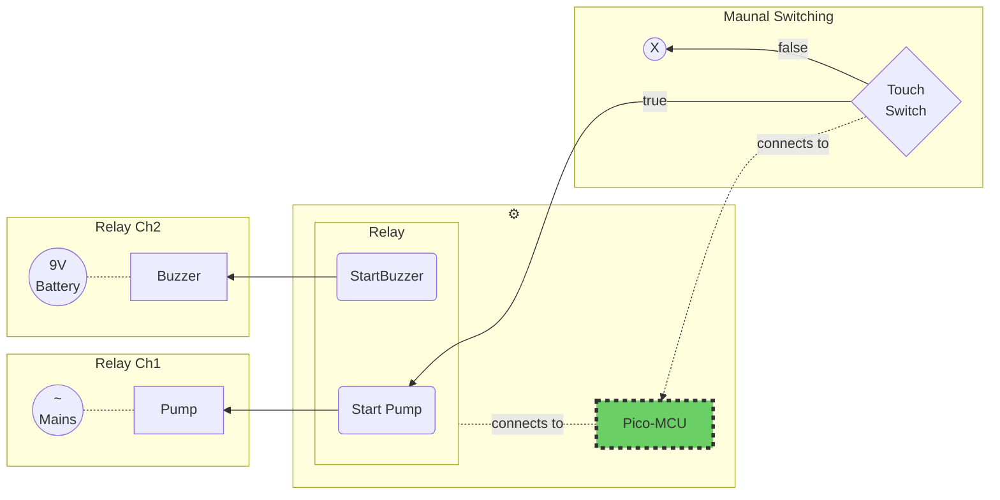
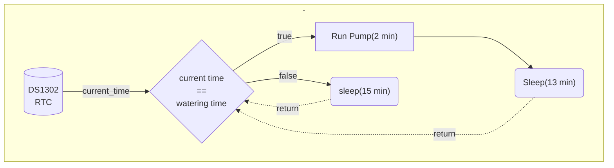

## Introduction

While we (me and my parents) were away from home, a lot of my mother's plants died because of excessive summer heat. Since, our dear maid also enjoyed our abcence and did not water the plants for a month — the resiliant ones perished as well. 

After witnessing this death and destruction, I decided to use technological intervention to resolve this trivial problem. The answer would be an **automated irrigator**, that would work reliably every day and water the plants. Such a system can be easily designed with low-cost microcontrollers and can be extremely cheap as well.

## Components

| Component                    | Cost(INR)|
|------------------------------|----------|
| Raspberry Pi Pico MCU        | ₹ 349    |
| 4-channel Relay Switch       | ₹ 169    |
| Submersible Water Pump       | ₹ 250    |
| Piping (xx m)                | ₹ 150    |
| Logic Converter (3.3V ↔ 5.0V)| ₹ 89     |
| Buzzer                       | ₹ 31     |
| Buzzer Power (9V battery)    | ₹ 20     |
| Touch Switch                 | ₹ 25     |
| Breadboard and wiring        | ₹ 150    |
| **Total (INR)**              | **₹ 0**  |
| **Total (USD)**              | **₹ 0**  |
Note: Prices may vary between different regions.


## Planning & Plotting

### Requirement

1. A system that triggers a submersible pump to run for a certain **m minutes** every day at a certain time **t (hh:mm)**.
2. It should also have an option to trigger the pump on demand (some kind of switch).
3. It should be resiliant to power outages, i.e. - the system should maintain time even if power is disconnected.


### Microcontroller
<div class="center">
        
</div>

I am going to use a [Raspberry Pi Pico](https://www.raspberrypi.com/products/raspberry-pi-pico/) microcontroller. It is cheap, fast, reliable and comes with 2 cores! It can also be programmed with `Micropython` and thus makes this project an excellent  *first-Micropython-project*. `Rpi` is a `low-power` MCU and runs on `3.3V LVTTL` and thus is excellent for operations that require long timescales.

#### Circuit Diagram

### Control Flow

The program checks time every (say) `15 minutes` and compares it to the scheduled time. If the time matches, it runs the pump for `m` minutes. The processor immediately goes to sleep if the time-matching fails. Otherwise, the motor is first operated and then the processor goes into sleep mode. Sleep mode ensures low power operation. 

For manual operation of the pump, a touch button is programmed. Whenever the user actuates the switch (the button signal is `HIGH`), the motor is run for `2 seconds`. After this time elapses, the system again checks for the button state. Hence, the motor runs only when the user gestures against the touch switch.

This button's input pin is connected to an `Interrupt`, so that an action can be triggered while the processor is set to sleep mode by the main time-matching program loop.


##### Peripheral Connections




##### Decision Flowchart




### Reading Time

The problem of reading and maintaining time can be done soved by using a **Real Time Clock (RTC).** RTC is a hardware module that is capable of maintining wallclock time even during power outages. It accomplishes this by having its own power source -  usually a 3V button cell. The button cell that you usually see on your computer motherboard is there for the RTC!

There is an on-chip RTC on the RPi Pico. But, it is more like a `Lifetime timer`, because it does not accept external power and cannot be calibrated. See [here](https://forums.raspberrypi.com/viewtopic.php?t=325598). The on-chip RTC date time value is updated automatically when Pico is connected to PC for programming with `Micropython`.  This functionality is useful for setting the external RTC we will connect to the board -  the **DS1302**.

In `C++`,  setting the RTC with the PC machine time is trivial:

```c++
# Libray in use: `RTC by Makuna`.
RtcDateTime compiled_time;
compiled_time = RtcDateTime(__DATE__, __TIME__);
rtc_chip.SetDateTime(compiled_time);
```

The macros `__DATE__` and `__TIME__` provide the compilation time inside the program scope.

Doing the same in `Micropython` (my approach):

```python
ds = ds1302.DS1302(Pin(18),Pin(17),Pin(16))

if set_rtc:
    # on-chip RTC returns ↓
    # (0:year, 1:month, 2:mday, 3:hour, 4:minute, 5:second, 6:weekday, 7:yearday)
    year, month, mday, hour, minute, second, weekday, yearday = time.localtime()
    
    # External DS1302 accepts the following arguements ↓ (SET the RTC)
    ds.date_time([year, month, mday, weekday, hour, minute, second])
```

Changing the order of the arguments would return a jumbled time. The `ds1302 module` can be found [here](https://github.com/Guitarman9119/Raspberry-Pi-Pico-/blob/main/DS1302%20RTC/ds1302.py).

### Switching Components

For switching the water pump and the buzzer, which are connected to independent power sources, we use a relay switch. A Relay switch is a device that can be used to switch a high power (voltage and/or current) circuit with a low-power signal (3.3V or 5V logic signal). A Realy Switch hence forms the bridge between a microcontroller and electrical components that work with main power supply.

We use Channel 1 to control the Buzzer. And Channel 2 to control the Pump. Both the components are connected in the `Normally Open` relay configuration. 

 


## Results

TODO -> Include a working video


## Using the second core

